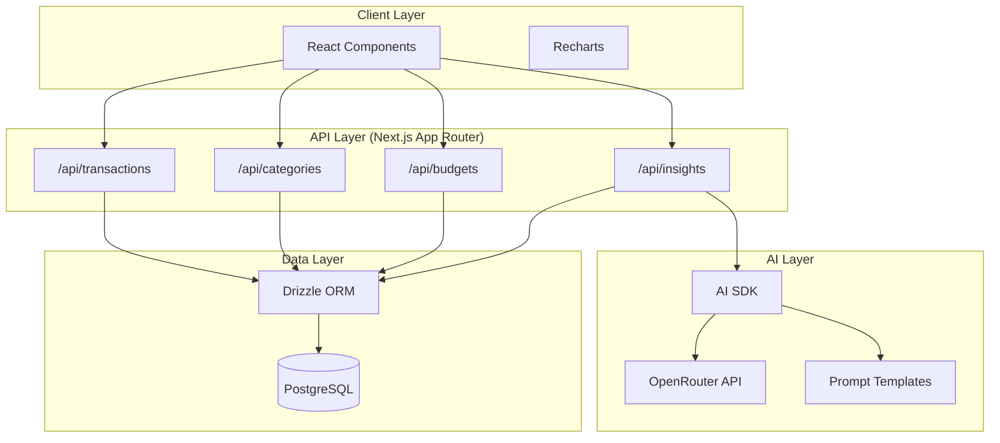
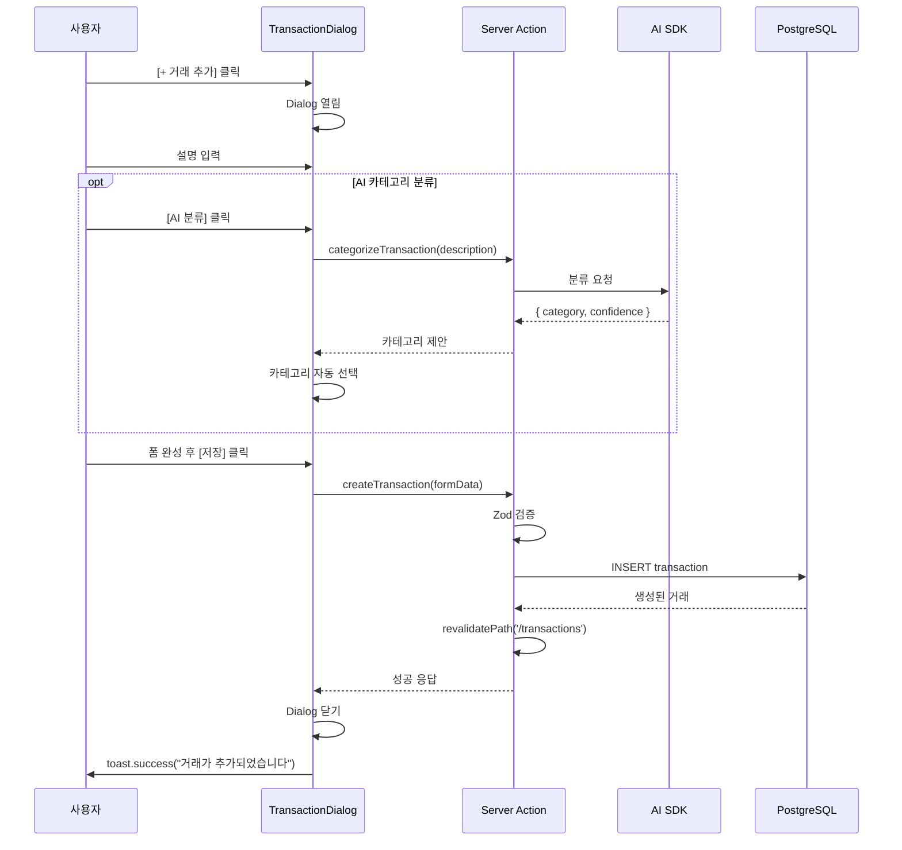
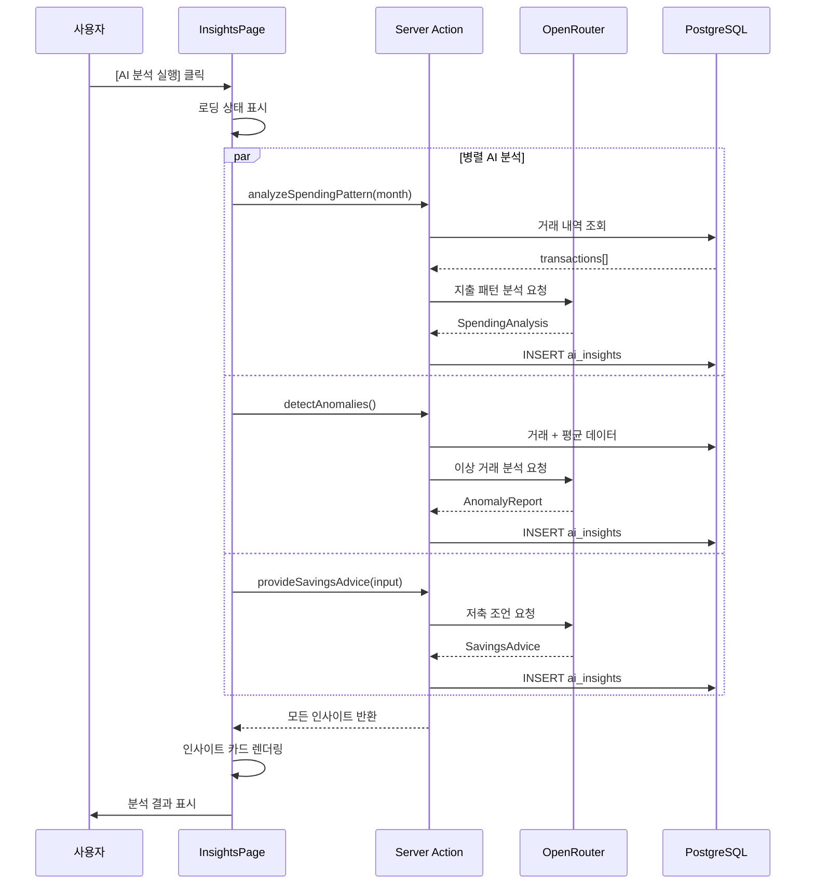
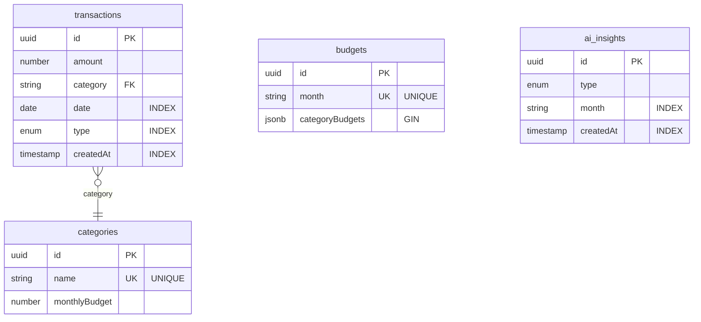
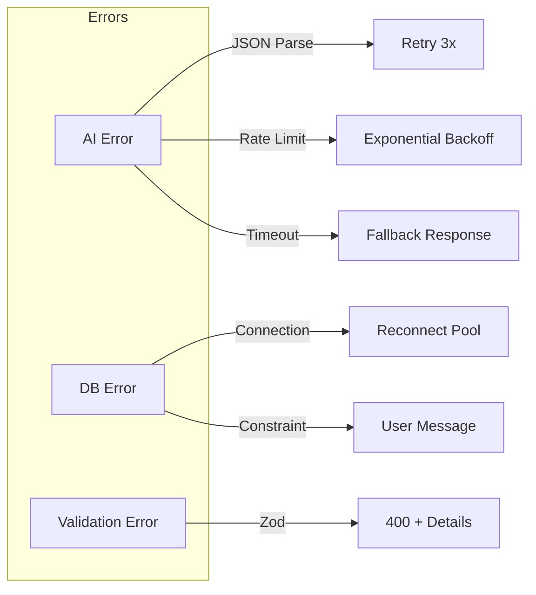

# AI Personal Finance - Architecture

## 1. 시스템 개요

### 1.1 애플리케이션 목적
AI 기반 개인 재무 관리 앱으로, 거래 기록 관리, AI 지출 패턴 분석, 예산 관리, 저축 조언, 자동 카테고리 분류 기능을 제공합니다.

### 1.2 기술 스택
| 계층 | 기술 |
|------|------|
| 프레임워크 | Next.js 14 (App Router) |
| 언어 | TypeScript |
| 데이터베이스 | PostgreSQL + Drizzle ORM |
| AI | AI SDK + OpenRouter |
| 모델 | anthropic/claude-haiku-4.5 |
| UI | shadcn/ui + Tailwind CSS |
| 차트 | Recharts |
| 검증 | Zod |

### 1.3 아키텍처 다이어그램


---

## 2. Server Actions 구조

### 2.1 actions/ 폴더 구조
```
app/actions/
├── transaction-actions.ts   # 거래 관련 Server Actions
├── category-actions.ts      # 카테고리 관련 Server Actions
├── budget-actions.ts        # 예산 관련 Server Actions
└── ai-actions.ts            # AI 분석 관련 Server Actions
```

### 2.2 Server Actions 함수명 및 역할

#### transaction-actions.ts
| 함수명 | 역할 | 입력 | 출력 |
|--------|------|------|------|
| `createTransaction` | 거래 생성 | TransactionFormData | Transaction |
| `updateTransaction` | 거래 수정 | id, TransactionFormData | Transaction |
| `deleteTransaction` | 거래 삭제 | id | void |
| `getTransactions` | 거래 목록 조회 | FilterParams? | Transaction[] |
| `getTransactionById` | 단일 거래 조회 | id | Transaction |

#### category-actions.ts
| 함수명 | 역할 | 입력 | 출력 |
|--------|------|------|------|
| `createCategory` | 카테고리 생성 | CategoryFormData | Category |
| `updateCategory` | 카테고리 수정 | id, CategoryFormData | Category |
| `deleteCategory` | 카테고리 삭제 | id | void |
| `getCategories` | 카테고리 목록 조회 | - | Category[] |

#### budget-actions.ts
| 함수명 | 역할 | 입력 | 출력 |
|--------|------|------|------|
| `saveBudget` | 예산 저장/수정 | BudgetFormData | Budget |
| `getBudget` | 월별 예산 조회 | month (YYYY-MM) | Budget |
| `getBudgetUsage` | 예산 사용률 조회 | month | BudgetUsage |

#### ai-actions.ts
| 함수명 | 역할 | 입력 | 출력 |
|--------|------|------|------|
| `analyzeSpendingPattern` | 지출 패턴 분석 | month | SpendingAnalysis |
| `suggestBudget` | AI 예산 제안 | income | BudgetSuggestion |
| `categorizeTransaction` | AI 카테고리 분류 | description | CategorySuggestion |
| `detectAnomalies` | 이상 거래 감지 | - | AnomalyReport |
| `provideSavingsAdvice` | 저축 조언 | SavingsInput | SavingsAdvice |

### 2.3 Server Actions 패턴
```typescript
// 'use server' 지시어로 Server Action 선언
'use server'

import { db } from '@/lib/db'
import { transactions } from '@/lib/db/schema'
import { revalidatePath } from 'next/cache'
import { transactionSchema } from '@/lib/validations'

export async function createTransaction(formData: TransactionFormData) {
  // 1. Zod 검증
  const validated = transactionSchema.parse(formData)

  // 2. DB 작업
  const [transaction] = await db
    .insert(transactions)
    .values(validated)
    .returning()

  // 3. 캐시 무효화
  revalidatePath('/transactions')

  return transaction
}
```

---

## 3. 컴포넌트 구조

### 3.1 components/ 폴더 계층
```
components/
├── ui/                      # shadcn/ui 기본 컴포넌트
│   ├── button.tsx
│   ├── card.tsx
│   ├── dialog.tsx
│   ├── input.tsx
│   ├── select.tsx
│   ├── tabs.tsx
│   └── toast.tsx
│
├── layout/                  # 레이아웃 컴포넌트
│   ├── header.tsx           # 상단 네비게이션
│   ├── main-layout.tsx      # 메인 레이아웃
│   └── tab-navigation.tsx   # 탭 네비게이션
│
├── transactions/            # 거래 관련 컴포넌트
│   ├── transaction-list.tsx        # 거래 목록
│   ├── transaction-card.tsx        # 단일 거래 카드
│   ├── transaction-form.tsx        # 거래 입력 폼
│   ├── transaction-dialog.tsx      # 거래 추가/수정 다이얼로그
│   └── transaction-filters.tsx     # 검색/필터 바
│
├── categories/              # 카테고리 관련 컴포넌트
│   ├── category-list.tsx
│   ├── category-card.tsx
│   ├── category-form.tsx
│   └── category-dialog.tsx
│
├── budget/                  # 예산 관련 컴포넌트
│   ├── budget-overview.tsx         # 예산 개요
│   ├── budget-form.tsx             # 예산 입력 폼
│   ├── budget-progress.tsx         # 예산 사용률 진행바
│   └── ai-budget-suggestion.tsx    # AI 예산 제안 패널
│
├── insights/                # AI 인사이트 컴포넌트
│   ├── insight-card.tsx            # 인사이트 카드
│   ├── spending-pattern-card.tsx   # 지출 패턴 분석
│   ├── anomaly-alert-card.tsx      # 이상 거래 알림
│   └── savings-advice-card.tsx     # 저축 조언
│
├── charts/                  # 차트 컴포넌트
│   ├── monthly-chart.tsx           # 월별 수입/지출 Line Chart
│   ├── category-pie-chart.tsx      # 카테고리별 Pie Chart
│   ├── daily-bar-chart.tsx         # 일별 지출 Bar Chart
│   └── budget-comparison-chart.tsx # 예산 vs 실제 비교 차트
│
└── shared/                  # 공통 컴포넌트
    ├── loading-spinner.tsx
    ├── error-boundary.tsx
    ├── empty-state.tsx
    └── month-picker.tsx
```

### 3.2 상태 관리

#### 클라이언트 상태 (React useState/useReducer)
```typescript
// 로컬 UI 상태 관리
const [isDialogOpen, setIsDialogOpen] = useState(false)
const [selectedTransaction, setSelectedTransaction] = useState<Transaction | null>(null)
const [filters, setFilters] = useState<FilterState>(defaultFilters)
```

#### 서버 상태 (Server Components + revalidatePath)
```typescript
// 서버 컴포넌트에서 직접 데이터 fetch
// app/transactions/page.tsx
export default async function TransactionsPage() {
  const transactions = await getTransactions()
  return <TransactionList transactions={transactions} />
}

// Server Action 후 캐시 무효화
revalidatePath('/transactions')
```

#### 폼 상태 (useFormState + useFormStatus)
```typescript
// React 19 폼 상태 관리
const [state, formAction] = useFormState(createTransaction, initialState)
const { pending } = useFormStatus()
```

---

## 4. 인터랙션 플로우

### 4.1 거래 추가 플로우


### 4.2 AI 분석 플로우


---

## 5. 파일 구조

### 5.1 전체 프로젝트 구조
```
day17-personal-finance/
├── app/                          # Next.js App Router
│   ├── layout.tsx                # 루트 레이아웃
│   ├── page.tsx                  # 메인 페이지 (대시보드)
│   ├── globals.css               # 전역 스타일
│   │
│   ├── actions/                  # Server Actions
│   │   ├── transaction-actions.ts
│   │   ├── category-actions.ts
│   │   ├── budget-actions.ts
│   │   └── ai-actions.ts
│   │
│   ├── (routes)/                 # 라우트 그룹
│   │   ├── transactions/
│   │   │   └── page.tsx
│   │   ├── budget/
│   │   │   └── page.tsx
│   │   ├── categories/
│   │   │   └── page.tsx
│   │   └── insights/
│   │       └── page.tsx
│   │
│   └── api/                      # API Routes (필요시)
│       └── ...
│
├── components/                   # React 컴포넌트
│   ├── ui/                       # shadcn/ui
│   ├── layout/
│   ├── transactions/
│   ├── categories/
│   ├── budget/
│   ├── insights/
│   ├── charts/
│   └── shared/
│
├── lib/                          # 유틸리티 및 설정
│   ├── db/                       # 데이터베이스
│   │   ├── index.ts              # Drizzle 클라이언트
│   │   ├── schema.ts             # 테이블 스키마
│   │   └── migrations/           # DB 마이그레이션
│   │
│   ├── ai/                       # AI 관련
│   │   ├── client.ts             # OpenRouter 클라이언트
│   │   ├── prompts.ts            # 프롬프트 템플릿
│   │   └── response-parser.ts    # AI 응답 정제
│   │
│   ├── validations/              # Zod 스키마
│   │   ├── transaction.ts
│   │   ├── category.ts
│   │   ├── budget.ts
│   │   └── ai-response.ts
│   │
│   └── utils/                    # 유틸리티 함수
│       ├── format.ts             # 금액, 날짜 포맷
│       └── constants.ts          # 상수
│
├── docs/                         # 문서
│   ├── PRD.md
│   └── ARCHITECTURE.md
│
├── drizzle.config.ts             # Drizzle 설정
├── next.config.js                # Next.js 설정
├── tailwind.config.ts            # Tailwind 설정
├── tsconfig.json                 # TypeScript 설정
└── package.json
```

---

## 6. 주요 설계 결정

### 6.1 Server Actions vs API Routes
**결정: Server Actions 우선 사용**

| 항목 | Server Actions | API Routes |
|------|---------------|------------|
| 사용 시점 | 폼 제출, 데이터 mutation | 외부 API 노출 필요시 |
| 장점 | 타입 안전성, 코드 간결, 번들 최적화 | RESTful, 외부 접근 가능 |
| 적용 | 거래/카테고리/예산 CRUD | - |

### 6.2 상태 관리 전략
**결정: 최소화된 클라이언트 상태**

```typescript
// ✅ 권장: Server Components + revalidatePath
// 서버에서 데이터 fetch, mutation 후 캐시 무효화

// ❌ 지양: 전역 상태 라이브러리 (Redux, Zustand)
// 불필요한 클라이언트 번들 증가
```

### 6.3 차트 렌더링
**결정: Dynamic Import로 클라이언트 렌더링**

```typescript
// Recharts는 클라이언트에서만 동작
const MonthlyChart = dynamic(() => import('@/components/charts/monthly-chart'), {
  ssr: false,
  loading: () => <ChartSkeleton />
})
```

### 6.4 AI 호출 최적화
**결정: 캐싱 + 재시도 + 타임아웃**

```typescript
const AI_CONFIG = {
  model: 'anthropic/claude-haiku-4.5',
  maxTokens: 1500,
  temperature: 0.7,
  cache: { ttl: 3600000 },      // 1시간 캐시
  retry: {
    maxAttempts: 3,
    backoff: 'exponential'
  },
  timeout: 30000                 // 30초 타임아웃
}
```

### 6.5 에러 핸들링 전략
```typescript
// Server Action 에러 처리 패턴
export async function createTransaction(formData: FormData) {
  try {
    const validated = transactionSchema.parse(Object.fromEntries(formData))
    const result = await db.insert(transactions).values(validated).returning()
    revalidatePath('/transactions')
    return { success: true, data: result[0] }
  } catch (error) {
    if (error instanceof z.ZodError) {
      return { success: false, error: 'validation', details: error.errors }
    }
    return { success: false, error: 'database', message: '저장에 실패했습니다' }
  }
}
```

---

## 7. AI 응답 정제 로직

### 7.1 문제점
AI 모델이 JSON 외에 추가 텍스트(설명, 마크다운 코드 블록 등)를 포함하여 응답할 수 있음.

### 7.2 정제 로직 (lib/ai/response-parser.ts)
```typescript
export function parseAIResponse<T>(response: string, schema: z.ZodSchema<T>): T {
  // 1단계: 마크다운 코드 블록 제거
  let cleaned = response
    .replace(/```json\s*/gi, '')
    .replace(/```\s*/g, '')
    .trim()

  // 2단계: JSON 추출 (첫 번째 { 부터 마지막 } 까지)
  const jsonMatch = cleaned.match(/\{[\s\S]*\}/)
  if (!jsonMatch) {
    throw new AIParseError('JSON 형식을 찾을 수 없습니다', response)
  }
  cleaned = jsonMatch[0]

  // 3단계: JSON 파싱
  let parsed: unknown
  try {
    parsed = JSON.parse(cleaned)
  } catch (e) {
    // 3-1: 일반적인 JSON 오류 수정 시도
    cleaned = fixCommonJSONErrors(cleaned)
    parsed = JSON.parse(cleaned)
  }

  // 4단계: Zod 스키마 검증
  return schema.parse(parsed)
}

function fixCommonJSONErrors(json: string): string {
  return json
    // trailing comma 제거
    .replace(/,\s*}/g, '}')
    .replace(/,\s*]/g, ']')
    // 작은따옴표 → 큰따옴표
    .replace(/'/g, '"')
    // NaN, undefined → null
    .replace(/\bNaN\b/g, 'null')
    .replace(/\bundefined\b/g, 'null')
}
```

### 7.3 AI 호출 래퍼 함수
```typescript
// lib/ai/client.ts
import { generateText } from 'ai'
import { createOpenAI } from '@ai-sdk/openai'

const openrouter = createOpenAI({
  baseURL: 'https://openrouter.ai/api/v1',
  apiKey: process.env.OPENROUTER_API_KEY!,
})

export async function callAI<T>(
  prompt: string,
  schema: z.ZodSchema<T>,
  retries = 3
): Promise<T> {
  let lastError: Error | null = null

  for (let attempt = 1; attempt <= retries; attempt++) {
    try {
      const { text } = await generateText({
        model: openrouter('anthropic/claude-haiku-4.5'),
        prompt,
        maxTokens: 1500,
        temperature: 0.7,
      })

      return parseAIResponse(text, schema)
    } catch (error) {
      lastError = error as Error
      console.warn(`AI 호출 시도 ${attempt}/${retries} 실패:`, error)

      if (attempt < retries) {
        // 지수 백오프: 1초, 2초, 4초...
        await new Promise(r => setTimeout(r, 1000 * Math.pow(2, attempt - 1)))
      }
    }
  }

  throw new AIError(`AI 호출 실패 (${retries}회 시도)`, lastError)
}
```

### 7.4 응답 스키마 예시
```typescript
// lib/validations/ai-response.ts
import { z } from 'zod'

export const spendingAnalysisSchema = z.object({
  summary: z.string(),
  topSpending: z.array(z.object({
    category: z.string(),
    amount: z.number(),
    percentage: z.number().min(0).max(100)
  })),
  unnecessarySpending: z.array(z.string()),
  savingOpportunities: z.array(z.object({
    item: z.string(),
    potentialSaving: z.number().nonnegative()
  })),
  trends: z.array(z.string())
})

export const categorySuggestionSchema = z.object({
  suggestedCategory: z.string(),
  confidence: z.number().min(0).max(1),
  reasoning: z.string()
})

export const anomalyReportSchema = z.object({
  anomalies: z.array(z.object({
    transaction: z.object({
      amount: z.number(),
      category: z.string(),
      date: z.string()
    }),
    reason: z.string(),
    severity: z.enum(['high', 'medium', 'low'])
  })),
  summary: z.string(),
  recommendation: z.string()
})
```

---

## 8. Index Strategy (기존 내용)



**Composite Indexes:**
```sql
-- transactions: 월별 조회 최적화
CREATE INDEX idx_tx_date_type_cat ON transactions(date, type, category);

-- ai_insights: 인사이트 조회
CREATE INDEX idx_insights_month_type ON ai_insights(month, type);
```

---

## 9. Error Handling (기존 내용)



**Error Response:**
```typescript
{ error: string, code: string, details?: ZodError }
```

---

## 10. Input Validation (기존 내용)

**Zod Schemas (`lib/validations/`):**

```typescript
// Transaction
z.object({
  amount: z.number().positive(),
  category: z.string().min(1),
  description: z.string().max(255),
  date: z.coerce.date().max(new Date()),
  type: z.enum(['income', 'expense']),
  paymentMethod: z.enum(['cash', 'card', 'transfer'])
})

// Budget
z.object({
  month: z.string().regex(/^\d{4}-\d{2}$/),
  totalBudget: z.number().positive(),
  categoryBudgets: z.record(z.number().positive())
})
```
