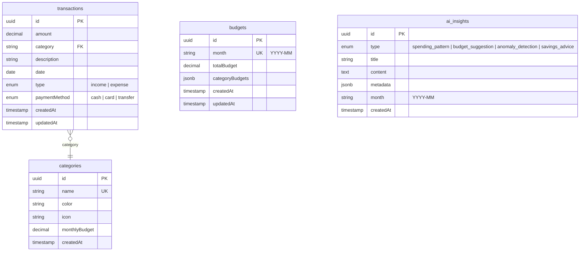

# AI Personal Finance - Database Documentation

## 1. 스키마 개요

| 테이블 | 설명 | 주요 필드 |
|--------|------|-----------|
| `transactions` | 수입/지출 거래 내역 | amount, category, type, date |
| `categories` | 지출 카테고리 | name, color, icon, monthlyBudget |
| `budgets` | 월별 예산 설정 | month, totalBudget, categoryBudgets |
| `ai_insights` | AI 분석 결과 저장 | type, title, content, month |

---

## 2. ERD (Entity Relationship Diagram)



---

## 3. 테이블 정의

### 3.1 transactions (거래)
```typescript
{
  id: string           // uuid, PK
  amount: number       // 금액 (양수)
  category: string     // FK → categories.name
  description: string  // 거래 설명 (최대 255자)
  date: Date           // 거래 날짜
  type: 'income' | 'expense'  // 수입/지출
  paymentMethod: 'cash' | 'card' | 'transfer'  // 결제 수단
  createdAt: Date      // 생성일
  updatedAt: Date      // 수정일
}
```

### 3.2 categories (카테고리)
```typescript
{
  id: string              // uuid, PK
  name: string            // 카테고리명 (unique)
  color: string           // HEX 색상 (#RRGGBB)
  icon: string            // 아이콘 이름
  monthlyBudget: number | null  // 월 예산 (선택)
  createdAt: Date         // 생성일
}
```

**기본 카테고리:**
- 식비, 교통, 쇼핑, 공과금, 주거, 의료, 문화, 기타

### 3.3 budgets (예산)
```typescript
{
  id: string              // uuid, PK
  month: string           // YYYY-MM 형식
  totalBudget: number     // 총 예산
  categoryBudgets: {      // 카테고리별 예산 (JSONB)
    [category: string]: number
  }
  createdAt: Date
  updatedAt: Date
}
```

### 3.4 ai_insights (AI 인사이트)
```typescript
{
  id: string              // uuid, PK
  type: 'spending_pattern' | 'budget_suggestion' | 'anomaly_detection' | 'savings_advice'
  title: string           // 인사이트 제목
  content: string         // 분석 내용 (text)
  metadata: object        // 추가 데이터 (JSONB)
  month: string           // YYYY-MM
  createdAt: Date
}
```

---

## 4. Drizzle 스키마 (lib/db/schema.ts)

```typescript
import { pgTable, uuid, varchar, decimal, date, timestamp, text, jsonb, pgEnum } from 'drizzle-orm/pg-core'

// Enums
export const transactionTypeEnum = pgEnum('transaction_type', ['income', 'expense'])
export const paymentMethodEnum = pgEnum('payment_method', ['cash', 'card', 'transfer'])
export const insightTypeEnum = pgEnum('insight_type', [
  'spending_pattern',
  'budget_suggestion',
  'anomaly_detection',
  'savings_advice'
])

// Categories
export const categories = pgTable('categories', {
  id: uuid('id').defaultRandom().primaryKey(),
  name: varchar('name', { length: 50 }).notNull().unique(),
  color: varchar('color', { length: 7 }).notNull().default('#6366f1'),
  icon: varchar('icon', { length: 50 }).notNull().default('receipt'),
  monthlyBudget: decimal('monthly_budget', { precision: 12, scale: 2 }),
  createdAt: timestamp('created_at').defaultNow().notNull(),
})

// Transactions
export const transactions = pgTable('transactions', {
  id: uuid('id').defaultRandom().primaryKey(),
  amount: decimal('amount', { precision: 12, scale: 2 }).notNull(),
  category: varchar('category', { length: 50 })
    .notNull()
    .references(() => categories.name),
  description: varchar('description', { length: 255 }).notNull(),
  date: date('date').notNull(),
  type: transactionTypeEnum('type').notNull(),
  paymentMethod: paymentMethodEnum('payment_method').notNull().default('card'),
  createdAt: timestamp('created_at').defaultNow().notNull(),
  updatedAt: timestamp('updated_at').defaultNow().notNull(),
})

// Budgets
export const budgets = pgTable('budgets', {
  id: uuid('id').defaultRandom().primaryKey(),
  month: varchar('month', { length: 7 }).notNull().unique(), // YYYY-MM
  totalBudget: decimal('total_budget', { precision: 12, scale: 2 }).notNull(),
  categoryBudgets: jsonb('category_budgets').$type<Record<string, number>>().notNull().default({}),
  createdAt: timestamp('created_at').defaultNow().notNull(),
  updatedAt: timestamp('updated_at').defaultNow().notNull(),
})

// AI Insights
export const aiInsights = pgTable('ai_insights', {
  id: uuid('id').defaultRandom().primaryKey(),
  type: insightTypeEnum('type').notNull(),
  title: varchar('title', { length: 200 }).notNull(),
  content: text('content').notNull(),
  metadata: jsonb('metadata').$type<Record<string, unknown>>().default({}),
  month: varchar('month', { length: 7 }).notNull(), // YYYY-MM
  createdAt: timestamp('created_at').defaultNow().notNull(),
})

// Type exports
export type Category = typeof categories.$inferSelect
export type NewCategory = typeof categories.$inferInsert
export type Transaction = typeof transactions.$inferSelect
export type NewTransaction = typeof transactions.$inferInsert
export type Budget = typeof budgets.$inferSelect
export type NewBudget = typeof budgets.$inferInsert
export type AiInsight = typeof aiInsights.$inferSelect
export type NewAiInsight = typeof aiInsights.$inferInsert
```

---

## 5. 인덱스 전략

### 5.1 Drizzle 인덱스 정의
```typescript
import { index } from 'drizzle-orm/pg-core'

// transactions 인덱스
export const transactions = pgTable('transactions', {
  // ... columns
}, (table) => ({
  dateIdx: index('idx_tx_date').on(table.date),
  typeIdx: index('idx_tx_type').on(table.type),
  categoryIdx: index('idx_tx_category').on(table.category),
  dateTypeCatIdx: index('idx_tx_date_type_cat').on(table.date, table.type, table.category),
}))

// ai_insights 인덱스
export const aiInsights = pgTable('ai_insights', {
  // ... columns
}, (table) => ({
  monthIdx: index('idx_insights_month').on(table.month),
  monthTypeIdx: index('idx_insights_month_type').on(table.month, table.type),
}))
```

### 5.2 인덱스 용도
| 인덱스 | 용도 |
|--------|------|
| `idx_tx_date` | 날짜별 거래 조회 |
| `idx_tx_type` | 수입/지출 필터링 |
| `idx_tx_category` | 카테고리별 조회 |
| `idx_tx_date_type_cat` | 월별 통계, 복합 필터 |
| `idx_insights_month_type` | 월별 인사이트 조회 |

---

## 6. 마이그레이션 명령어

### 6.1 Drizzle 설정 (drizzle.config.ts)
```typescript
import type { Config } from 'drizzle-kit'

export default {
  schema: './lib/db/schema.ts',
  out: './lib/db/migrations',
  driver: 'pg',
  dbCredentials: {
    connectionString: process.env.DATABASE_URL!,
  },
} satisfies Config
```

### 6.2 명령어
```bash
# 마이그레이션 생성
npx drizzle-kit generate:pg

# 마이그레이션 실행
npx drizzle-kit push:pg

# DB Studio (GUI)
npx drizzle-kit studio

# 스키마 변경 확인
npx drizzle-kit check:pg
```

### 6.3 DB 클라이언트 (lib/db/index.ts)
```typescript
import { drizzle } from 'drizzle-orm/postgres-js'
import postgres from 'postgres'
import * as schema from './schema'

const connectionString = process.env.DATABASE_URL!
const client = postgres(connectionString)

export const db = drizzle(client, { schema })
```

---

## 7. 쿼리 패턴

### 7.1 거래 조회 (필터 적용)
```typescript
import { and, eq, gte, lte, desc } from 'drizzle-orm'

async function getTransactions(filters: {
  startDate?: string
  endDate?: string
  category?: string
  type?: 'income' | 'expense'
}) {
  const conditions = []

  if (filters.startDate) {
    conditions.push(gte(transactions.date, filters.startDate))
  }
  if (filters.endDate) {
    conditions.push(lte(transactions.date, filters.endDate))
  }
  if (filters.category) {
    conditions.push(eq(transactions.category, filters.category))
  }
  if (filters.type) {
    conditions.push(eq(transactions.type, filters.type))
  }

  return db
    .select()
    .from(transactions)
    .where(conditions.length > 0 ? and(...conditions) : undefined)
    .orderBy(desc(transactions.date))
}
```

### 7.2 월별 통계 집계
```typescript
import { sql, sum } from 'drizzle-orm'

async function getMonthlyStats(month: string) {
  const startDate = `${month}-01`
  const endDate = `${month}-31`

  const result = await db
    .select({
      type: transactions.type,
      category: transactions.category,
      total: sum(transactions.amount).mapWith(Number),
    })
    .from(transactions)
    .where(
      and(
        gte(transactions.date, startDate),
        lte(transactions.date, endDate)
      )
    )
    .groupBy(transactions.type, transactions.category)

  return result
}
```

### 7.3 카테고리별 지출 합계
```typescript
async function getCategoryTotals(month: string) {
  return db
    .select({
      category: transactions.category,
      total: sum(transactions.amount).mapWith(Number),
    })
    .from(transactions)
    .where(
      and(
        eq(transactions.type, 'expense'),
        sql`to_char(${transactions.date}, 'YYYY-MM') = ${month}`
      )
    )
    .groupBy(transactions.category)
}
```

### 7.4 예산 vs 실제 지출 비교
```typescript
async function getBudgetComparison(month: string) {
  const [budget] = await db
    .select()
    .from(budgets)
    .where(eq(budgets.month, month))

  const spending = await getCategoryTotals(month)

  return {
    budget: budget?.categoryBudgets ?? {},
    actual: Object.fromEntries(
      spending.map(s => [s.category, s.total])
    ),
  }
}
```

### 7.5 AI 인사이트 저장
```typescript
async function saveInsight(insight: NewAiInsight) {
  const [saved] = await db
    .insert(aiInsights)
    .values(insight)
    .returning()

  return saved
}
```

### 7.6 최근 인사이트 조회
```typescript
async function getRecentInsights(month: string) {
  return db
    .select()
    .from(aiInsights)
    .where(eq(aiInsights.month, month))
    .orderBy(desc(aiInsights.createdAt))
}
```

---

## 8. 시드 데이터

```typescript
// lib/db/seed.ts
const defaultCategories: NewCategory[] = [
  { name: '식비', color: '#ef4444', icon: 'utensils' },
  { name: '교통', color: '#3b82f6', icon: 'car' },
  { name: '쇼핑', color: '#8b5cf6', icon: 'shopping-bag' },
  { name: '공과금', color: '#f59e0b', icon: 'zap' },
  { name: '주거', color: '#10b981', icon: 'home' },
  { name: '의료', color: '#ec4899', icon: 'heart' },
  { name: '문화', color: '#06b6d4', icon: 'film' },
  { name: '기타', color: '#6b7280', icon: 'more-horizontal' },
]

async function seed() {
  await db.insert(categories).values(defaultCategories).onConflictDoNothing()
  console.log('Seeded default categories')
}
```
